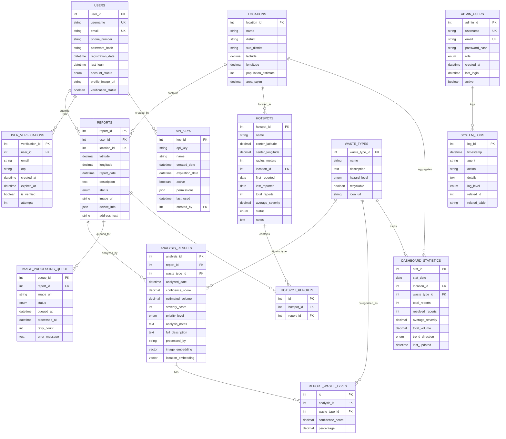

# duraeco Database Schema

<div align="center">
  
</div>

## Overview

Complete database schema for the duraeco environmental waste monitoring system. This schema supports community waste reporting, AI-powered analysis with Amazon Titan Embed vector embeddings, user authentication, hotspot clustering, and analytics.

### 🧠 Key AI Features:

- **VECTOR(1024)** embeddings for semantic similarity search via Amazon Titan Embed
- **AI analysis results** with confidence scores and severity classification
- **Geospatial indexing** for hotspot detection and mapping
- **Multi-application access** from mobile app (Flutter), web dashboard (Next.js), and admin panel

For complete architecture, see [Diagram/README.md](../Diagram/README.md).

## Entity Relationship Diagram



## Database Tables

### Core Tables

#### 1. **users**

User authentication and profiles for mobile app.

| Column                | Type         | Description                       |
| --------------------- | ------------ | --------------------------------- |
| `user_id`             | INT (PK)     | Auto-increment primary key        |
| `username`            | VARCHAR(50)  | Unique username                   |
| `email`               | VARCHAR(100) | Unique email (optional)           |
| `phone_number`        | VARCHAR(20)  | Contact number                    |
| `password_hash`       | VARCHAR(255) | Hashed password                   |
| `registration_date`   | DATETIME     | Account creation timestamp        |
| `last_login`          | DATETIME     | Last login timestamp              |
| `account_status`      | ENUM         | `active`, `inactive`, `suspended` |
| `profile_image_url`   | VARCHAR(255) | Profile picture URL               |
| `verification_status` | BOOLEAN      | Email verification status         |

#### 2. **reports**

Waste reports submitted by users via mobile app.

| Column         | Type          | Description                                                  |
| -------------- | ------------- | ------------------------------------------------------------ |
| `report_id`    | INT (PK)      | Auto-increment primary key                                   |
| `user_id`      | INT (FK)      | References users                                             |
| `latitude`     | DECIMAL(10,8) | GPS latitude                                                 |
| `longitude`    | DECIMAL(11,8) | GPS longitude                                                |
| `location_id`  | INT (FK)      | References locations                                         |
| `report_date`  | DATETIME      | Submission timestamp                                         |
| `description`  | TEXT          | User-provided description                                    |
| `status`       | ENUM          | `submitted`, `analyzing`, `analyzed`, `resolved`, `rejected` |
| `image_url`    | VARCHAR(255)  | AWS S3 image URL                                             |
| `device_info`  | JSON          | Mobile device metadata                                       |
| `address_text` | VARCHAR(255)  | Reverse geocoded address                                     |

**Indexes**: `(latitude, longitude)`, `(status)`, `(user_id)`, `(status, report_date)`

#### 3. **analysis_results**

AI analysis results from Amazon Bedrock Nova-Pro with vector embeddings.

| Column                   | Type             | Description                            |
| ------------------------ | ---------------- | -------------------------------------- |
| `analysis_id`            | INT (PK)         | Auto-increment primary key             |
| `report_id`              | INT (FK)         | References reports                     |
| `analyzed_date`          | DATETIME         | Analysis timestamp                     |
| `waste_type_id`          | INT (FK)         | Primary waste type detected            |
| `confidence_score`       | DECIMAL(5,2)     | AI confidence (0-100)                  |
| `estimated_volume`       | DECIMAL(10,2)    | Estimated waste volume                 |
| `severity_score`         | INT              | Severity rating                        |
| `priority_level`         | ENUM             | `low`, `medium`, `high`, `critical`    |
| `analysis_notes`         | TEXT             | Short AI analysis summary              |
| `full_description`       | TEXT             | Complete AI analysis                   |
| `processed_by`           | VARCHAR(50)      | AI model identifier                    |
| **`image_embedding`**    | **VECTOR(1024)** | **Amazon Titan Embed image embedding** |
| **`location_embedding`** | **VECTOR(1024)** | **Spatial vector embedding**           |

**Vector Embeddings**: Generated by Amazon Titan Embed Image v1 for semantic similarity search.

#### 4. **waste_types**

Waste classification categories used by AI.

| Column          | Type         | Description                |
| --------------- | ------------ | -------------------------- |
| `waste_type_id` | INT (PK)     | Auto-increment primary key |
| `name`          | VARCHAR(50)  | Waste type name            |
| `description`   | TEXT         | Waste type description     |
| `hazard_level`  | ENUM         | `low`, `medium`, `high`    |
| `recyclable`    | BOOLEAN      | Recyclability flag         |
| `icon_url`      | VARCHAR(255) | Icon image URL             |

**Standard Types**: Plastic, Paper, Glass, Metal, Organic, Electronic, Construction, Hazardous, Mixed

#### 5. **hotspots**

Geographic clusters of waste accumulation.

| Column             | Type          | Description                        |
| ------------------ | ------------- | ---------------------------------- |
| `hotspot_id`       | INT (PK)      | Auto-increment primary key         |
| `name`             | VARCHAR(100)  | Hotspot name                       |
| `center_latitude`  | DECIMAL(10,8) | Cluster center latitude            |
| `center_longitude` | DECIMAL(11,8) | Cluster center longitude           |
| `radius_meters`    | INT           | Cluster radius                     |
| `location_id`      | INT (FK)      | References locations               |
| `first_reported`   | DATE          | First report date                  |
| `last_reported`    | DATE          | Most recent report                 |
| `total_reports`    | INT           | Number of reports in cluster       |
| `average_severity` | DECIMAL(5,2)  | Average severity score             |
| `status`           | ENUM          | `active`, `monitoring`, `resolved` |
| `notes`            | TEXT          | Admin notes                        |

**Indexes**: `(center_latitude, center_longitude)`

#### 6. **locations**

Predefined locations/districts in Timor-Leste.

| Column                | Type          | Description                |
| --------------------- | ------------- | -------------------------- |
| `location_id`         | INT (PK)      | Auto-increment primary key |
| `name`                | VARCHAR(100)  | Location name              |
| `district`            | VARCHAR(100)  | District name              |
| `sub_district`        | VARCHAR(100)  | Sub-district name          |
| `latitude`            | DECIMAL(10,8) | Center latitude            |
| `longitude`           | DECIMAL(11,8) | Center longitude           |
| `population_estimate` | INT           | Population count           |
| `area_sqkm`           | DECIMAL(10,2) | Area in square kilometers  |

### Supporting Tables

#### 7. **report_waste_types**

Many-to-many relationship for multiple waste types in a single report.

| Column             | Type         | Description                 |
| ------------------ | ------------ | --------------------------- |
| `id`               | INT (PK)     | Auto-increment primary key  |
| `analysis_id`      | INT (FK)     | References analysis_results |
| `waste_type_id`    | INT (FK)     | References waste_types      |
| `confidence_score` | DECIMAL(5,2) | Type confidence score       |
| `percentage`       | DECIMAL(5,2) | Percentage composition      |

#### 8. **hotspot_reports**

Links reports to hotspots (many-to-many).

| Column       | Type     | Description                |
| ------------ | -------- | -------------------------- |
| `id`         | INT (PK) | Auto-increment primary key |
| `hotspot_id` | INT (FK) | References hotspots        |
| `report_id`  | INT (FK) | References reports         |

#### 9. **dashboard_statistics**

Pre-calculated analytics for dashboard performance.

| Column             | Type          | Description                          |
| ------------------ | ------------- | ------------------------------------ |
| `stat_id`          | INT (PK)      | Auto-increment primary key           |
| `stat_date`        | DATE          | Statistics date                      |
| `location_id`      | INT (FK)      | Location filter                      |
| `waste_type_id`    | INT (FK)      | Waste type filter                    |
| `total_reports`    | INT           | Total reports count                  |
| `resolved_reports` | INT           | Resolved count                       |
| `average_severity` | DECIMAL(5,2)  | Average severity                     |
| `total_volume`     | DECIMAL(10,2) | Total volume                         |
| `trend_direction`  | ENUM          | `increasing`, `stable`, `decreasing` |
| `last_updated`     | DATETIME      | Update timestamp                     |

**Indexes**: `(stat_date)`

#### 10. **image_processing_queue**

Queue for async image processing jobs.

| Column          | Type         | Description                                    |
| --------------- | ------------ | ---------------------------------------------- |
| `queue_id`      | INT (PK)     | Auto-increment primary key                     |
| `report_id`     | INT (FK)     | References reports                             |
| `image_url`     | VARCHAR(255) | S3 image URL                                   |
| `status`        | ENUM         | `pending`, `processing`, `completed`, `failed` |
| `queued_at`     | DATETIME     | Queue timestamp                                |
| `processed_at`  | DATETIME     | Processing completion                          |
| `retry_count`   | INT          | Retry attempts                                 |
| `error_message` | TEXT         | Error details                                  |

### Authentication Tables

#### 11. **user_verifications**

Email/OTP verification for user registration.

| Column            | Type         | Description                |
| ----------------- | ------------ | -------------------------- |
| `verification_id` | INT (PK)     | Auto-increment primary key |
| `user_id`         | INT (FK)     | References users           |
| `email`           | VARCHAR(100) | Email to verify            |
| `otp`             | VARCHAR(10)  | One-time password          |
| `created_at`      | DATETIME     | OTP creation time          |
| `expires_at`      | DATETIME     | OTP expiration             |
| `is_verified`     | BOOLEAN      | Verification status        |
| `attempts`        | INT          | Verification attempts      |

#### 12. **pending_registrations**

Temporary storage for unverified registrations.

| Column            | Type         | Description                |
| ----------------- | ------------ | -------------------------- |
| `registration_id` | INT (PK)     | Auto-increment primary key |
| `username`        | VARCHAR(50)  | Pending username           |
| `email`           | VARCHAR(100) | Pending email              |
| `phone_number`    | VARCHAR(20)  | Phone number               |
| `password_hash`   | VARCHAR(255) | Hashed password            |
| `otp`             | VARCHAR(10)  | Verification OTP           |
| `created_at`      | DATETIME     | Registration time          |
| `expires_at`      | DATETIME     | Expiration time            |
| `attempts`        | INT          | Verification attempts      |

#### 13. **api_keys**

API keys for external integrations.

| Column            | Type         | Description                |
| ----------------- | ------------ | -------------------------- |
| `key_id`          | INT (PK)     | Auto-increment primary key |
| `api_key`         | VARCHAR(255) | API key string             |
| `name`            | VARCHAR(100) | Key name/description       |
| `created_date`    | DATETIME     | Creation timestamp         |
| `expiration_date` | DATETIME     | Expiration date            |
| `active`          | BOOLEAN      | Active status              |
| `permissions`     | JSON         | Permission scopes          |
| `last_used`       | DATETIME     | Last usage timestamp       |
| `created_by`      | INT (FK)     | References users           |

### Admin Panel Tables

#### 14. **admin_users**

Admin panel user accounts (local only).

| Column          | Type         | Description                         |
| --------------- | ------------ | ----------------------------------- |
| `admin_id`      | INT (PK)     | Auto-increment primary key          |
| `username`      | VARCHAR(50)  | Admin username (unique)             |
| `email`         | VARCHAR(100) | Admin email (unique)                |
| `password_hash` | VARCHAR(255) | Hashed password                     |
| `role`          | ENUM         | `super_admin`, `admin`, `moderator` |
| `created_at`    | DATETIME     | Account creation                    |
| `last_login`    | DATETIME     | Last login timestamp                |
| `active`        | BOOLEAN      | Active status                       |

**Indexes**: `(username)`, `(email)`

#### 15. **system_logs**

System activity and audit logs.

| Column          | Type         | Description                            |
| --------------- | ------------ | -------------------------------------- |
| `log_id`        | INT (PK)     | Auto-increment primary key             |
| `timestamp`     | DATETIME     | Log timestamp                          |
| `agent`         | VARCHAR(50)  | Agent/service name                     |
| `action`        | VARCHAR(100) | Action performed                       |
| `details`       | TEXT         | Action details                         |
| `log_level`     | ENUM         | `info`, `warning`, `error`, `critical` |
| `related_id`    | INT          | Related entity ID                      |
| `related_table` | VARCHAR(50)  | Related table name                     |

#### 16. **system_settings**

Application configuration settings.

| Column          | Type         | Description                   |
| --------------- | ------------ | ----------------------------- |
| `setting_id`    | INT (PK)     | Auto-increment primary key    |
| `setting_key`   | VARCHAR(100) | Setting key (unique)          |
| `setting_value` | TEXT         | Setting value                 |
| `data_type`     | ENUM         | `string`, `number`, `boolean` |
| `description`   | TEXT         | Setting description           |
| `created_at`    | DATETIME     | Creation timestamp            |
| `updated_at`    | DATETIME     | Last update timestamp         |

**Indexes**: `(setting_key)`

#### 17. **notification_templates**

Email/SMS notification templates.

| Column        | Type         | Description                |
| ------------- | ------------ | -------------------------- |
| `template_id` | INT (PK)     | Auto-increment primary key |
| `name`        | VARCHAR(100) | Template name              |
| `subject`     | VARCHAR(255) | Email subject              |
| `body`        | TEXT         | Template body              |
| `type`        | ENUM         | `email`, `sms`, `push`     |
| `created_at`  | DATETIME     | Creation timestamp         |
| `updated_at`  | DATETIME     | Update timestamp           |

## Database Configuration

### Connection Example (Node.js):

```javascript
import mysql from "mysql2/promise";

const pool = mysql.createPool({
  host: process.env.DB_HOST,
  port: process.env.DB_PORT || 4000,
  user: process.env.DB_USER,
  password: process.env.DB_PASSWORD,
  database: process.env.DB_NAME,
  connectionLimit: 20,
  queueLimit: 0,
  waitForConnections: true,
});
```

### Connection Example (Python):

```python
import mysql.connector
from dbutils.pooled_db import PooledDB

pool = PooledDB(
    creator=mysql.connector,
    maxconnections=20,
    mincached=2,
    host=os.getenv('DB_HOST'),
    port=int(os.getenv('DB_PORT', 4000)),
    user=os.getenv('DB_USER'),
    password=os.getenv('DB_PASSWORD'),
    database=os.getenv('DB_NAME')
)
```

## Vector Search Operations

The `analysis_results` table contains two VECTOR(1024) columns for semantic similarity search.

### Find Similar Reports by Image:

```sql
-- Using Amazon Titan Embed image embeddings
SELECT
  r.report_id,
  r.description,
  r.image_url,
  ar.confidence_score,
  VEC_COSINE_DISTANCE(ar.image_embedding, :query_vector) as similarity
FROM reports r
JOIN analysis_results ar ON r.report_id = ar.report_id
WHERE ar.image_embedding IS NOT NULL
ORDER BY similarity ASC
LIMIT 10;
```

### Find Nearby Reports by Location:

```sql
-- Using location embeddings
SELECT
  r.report_id,
  r.latitude,
  r.longitude,
  ar.severity_score,
  VEC_COSINE_DISTANCE(ar.location_embedding, :query_location_vector) as distance
FROM reports r
JOIN analysis_results ar ON r.report_id = ar.report_id
WHERE ar.location_embedding IS NOT NULL
ORDER BY distance ASC
LIMIT 10;
```

## Setup Instructions

### 1. Create Database

```sql
CREATE DATABASE db_duraeco;
USE db_duraeco;
```

### 2. Run Schema Migration

```bash
# From database/ directory
mysql -u your_user -p db_duraeco < schema.sql
```

Or use individual table schemas from `all_schema/` folder.

### 3. Verify Vector Support

Ensure your database supports VECTOR data type (TiDB, MySQL 8.0.30+, or compatible):

```sql
SHOW CREATE TABLE analysis_results;
-- Should show: `image_embedding` vector(1024) DEFAULT NULL
```

### 4. Configure Application Connection

See connection examples above for Node.js and Python.

### 5. Seed Initial Data (Optional)

Insert waste types, locations, and admin users as needed.

## Performance Indexes

All performance-critical indexes are included in `schema.sql`:

- `idx_reports_location` - Geospatial queries
- `idx_reports_status_date` - Status filtering with date range
- `idx_analysis_results_date` - Time-series analysis
- `idx_hotspots_location` - Hotspot clustering
- `idx_dashboard_stats_date` - Dashboard analytics

## Security Best Practices

- ✅ Never commit database credentials to version control
- ✅ Use environment variables for all sensitive configuration
- ✅ Enable SSL/TLS for database connections in production
- ✅ Implement proper user access controls and roles
- ✅ Regular automated backups recommended
- ✅ Use prepared statements to prevent SQL injection
- ✅ Limit admin panel access to localhost only

---

For complete system architecture, see [Diagram/README.md](../Diagram/README.md).

---

## 📞 Additional Documentation

- **📱 Mobile App**: [../duraeco/README.md](../duraeco/README.md)
- **⚡ Backend API**: [../mobile_backend/README.md](../mobile_backend/README.md)
- **🌐 Public Dashboard**: [../duraeco_public_dahboard/README.md](../duraeco_public_dahboard/README.md)
- **👨‍💼 Admin Panel**: [../duraeco_admin_panel/README.md](../duraeco_admin_panel/README.md)
- **📊 System architecture**: [../Diagram/README.md](../Diagram/README.md)
- **📄 Main Project**: [../README.md](../README.md)

<div align="center">
  <p>AWS AI Agent Global Hackathon</p>
</div>
